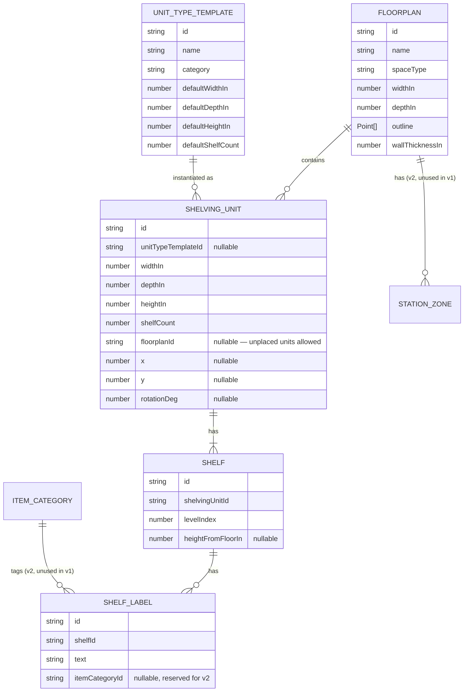

# Inventory Designer — Architecture

A single-restaurant tool for planning dry storage, walk-in, and shelving layouts
visually before doing the physical work of moving anything.

Status: **v1 planning/scaffold — no features implemented yet.**

---

## 1. Problem & v1 scope

Restaurants store things across dry storage rooms, walk-ins, and open shelving,
and it's hard to know whether a new layout will actually work before you move
racks and product around. v1 is a personal tool for one restaurant that lets you:

- Draw a 2D floorplan (room outline) for a storage space
- Define shelving unit types with real dimensions and shelf counts
- Place/arrange units within the floorplan
- Label individual shelves with what should go there
- Do all of this for multiple kinds of units (wire shelving, walk-in racks,
  cabinets, etc.) without the unit "type" being hardcoded

Explicitly **not** in v1: recommendation engine, food-safety placement rules,
auth, billing, multi-tenancy, real deployment. See [Roadmap](#6-phased-roadmap).

---

## 2. Tech stack

| Layer | Choice | Why |
|---|---|---|
| Language | TypeScript | Data model will evolve across three phases (v1→v2→v3); types catch breakage as fields get added (`itemCategoryId`, station zones, etc.) instead of failing silently at runtime. |
| Framework | React 18 + Vite | Huge ecosystem, fastest path for a solo dev, first-class support from the canvas binding library below. Vite gives instant dev-server startup and no config ceremony. |
| Canvas / editor | **Konva.js** via **react-konva** | Needed a canvas library for drag/resize/rotate of shapes. Chose Konva over Fabric.js because react-konva keeps the canvas scene declarative and in sync with React/Zustand state (Fabric's object model is imperative and fights React's render cycle unless you drop to manual refs everywhere). Konva also ships a built-in `Transformer` for resize/rotate handles and has solid touch/pointer support out of the box, which matters given tablet use. |
| App state | **Zustand** | Canvas interactions (dragging, resizing) fire frequent state updates. Context re-renders whole subtrees on every change; Zustand allows components to subscribe to just the slice they need. Much less ceremony than Redux for a solo MVP. |
| Persistence | **IndexedDB via Dexie.js**, behind a repository interface | See tradeoffs below — this was the one real fork in the road. |
| Styling | Plain CSS (component-scoped files) | No design system needed yet; adding Tailwind later is cheap if it turns out to be wanted, and skipping it now avoids an extra build dependency for v1. |
| Testing | Vitest (configured, not yet used) | Same tool family as Vite, zero extra config. Left minimal for v1 — a solo MVP doesn't need a full test suite yet, but the harness is there so adding tests isn't friction later. |

### Persistence: local-first (IndexedDB), not a hosted DB — for now

You confirmed connectivity in the actual storage areas (walk-ins, dry storage)
is often weak or absent, and that multi-device access ("plan on laptop, check
tablet in the walk-in") isn't a confirmed need yet. That makes **local-first
the right default**:

- **IndexedDB (via Dexie)** — data lives in the browser, works fully offline,
  no server to run or deploy, zero cost, matches "solo MVP" scope exactly.
  Dexie adds schema versioning and real queryable tables on top of raw
  IndexedDB, which matters because the schema *will* grow (v2 adds category
  tags, v3 adds constraint rules) — Dexie's versioned migrations handle that
  without hand-rolling IndexedDB upgrade logic.
  - Tradeoff: data is trapped in one browser on one device. Clearing browser
    data loses it (mitigated by an export/import-JSON feature, worth adding
    early). No sync between laptop and tablet.
- **Supabase (or similar hosted Postgres)** — the alternative. Gets you
  multi-device sync and a real backup story for free, but requires running/
  paying for a backend, adds an auth question ("whose data is this"), and
  is a network dependency exactly in the environment (walk-ins, storage
  rooms) where you said connectivity is worst. Overkill for proving out v1.

**How this stays open without a rewrite:** all reads/writes go through a
`Repository` interface (`src/data/repositories/*`) rather than components
calling Dexie directly. Swapping the Dexie implementation for a Supabase-backed
one later is a matter of writing a new class that satisfies the same
interface — UI and state layers don't change. This is the one deliberate
seam in the architecture; see [Open decisions](#7-open-decisions) for when it
might get exercised.

---

## 3. Data model

Core v1 entities, plus two entities that are *defined but unused* so v2 doesn't
require a schema rework (see callout below).



### Key modeling decisions

- **`UnitTypeTemplate` is a separate catalog from `ShelvingUnit`.** A template
  ("24×60 chrome wire shelving") is reusable; a `ShelvingUnit` is a specific
  physical unit you own, which starts from a template's defaults but can
  override its own dimensions (real units don't always match the spec sheet).
  `category` is a plain string, not a hardcoded enum, so adding a new kind of
  unit is a data change, not a code change — this is what satisfies "flexible,
  not hardcoded to one type."
- **`ShelvingUnit.floorplanId`/`x`/`y`/`rotationDeg` are nullable.** A unit can
  exist in your catalog before you've decided where it goes — useful for
  cataloging what you own before laying anything out, which is close to the
  actual workflow ("see at a glance what fits where before moving anything").
- **`Shelf` is a first-class row, not just a number on the unit.** Shelves
  need individual labels, so each one needs an id and an ordered position
  (`levelIndex`, counted bottom-up) independent of the parent unit. Counting
  bottom-up is deliberate: v3's food-safety rules ("raw protein below
  ready-to-eat") are inherently about vertical order, so the field already
  means the right thing when that logic gets built.
- **`ShelfLabel` is its own row, not a plain string field**, and it carries an
  optional `itemCategoryId`. In v1 that field is always null — the UI only
  ever collects free text. In v2, adding a category picker populates it
  without a migration, because the column already exists and already means
  "what category is stored here."
- **`ItemCategory` and `StationZone`** (in `src/types/reserved-v2.ts`) are
  type-defined now but have no UI, no seed data, and nothing writes to them in
  v1. They exist purely so the v2 recommendation engine ("cups near the drink
  station") has categories and zones to reference instead of needing a schema
  migration to introduce the concept. Nothing about v1 depends on them.

This is what "keep the architecture open without building it" means concretely:
the shape of the future feature is reserved in the type system; the behavior
is not built.

---

## 4. Mobile / tablet implications

This will primarily get used standing in a storage room or walk-in, on a
tablet or phone — not at a desk. That changes several v1 decisions even
though we're not building mobile-first UI yet:

- **Offline is a hard requirement, not a nice-to-have.** Already addressed by
  local-first IndexedDB storage — the app must fully function with zero
  network calls, because walk-in coolers routinely have no signal.
- **Touch, not hover.** No functionality can depend on a hover state (tooltip-
  only info, hover-to-reveal menus). Konva's pointer events unify mouse/touch,
  but component design (toolbar, properties panel) needs to assume touch too.
- **Target size.** Buttons and drag handles need to be finger-sized (~44px),
  not mouse-precision-sized — especially relevant for resize/rotate handles
  on placed units.
- **Precision dragging is harder on a small touchscreen than a mouse.** Grid
  snapping (see [Open decisions](#7-open-decisions)) matters more here than it
  would on desktop — it turns "drag to roughly the right spot" into "drag to
  the right spot."
- **Pinch-to-zoom/pan should be scoped to the canvas, not the whole page.**
  `index.html`'s viewport meta deliberately does *not* disable page zoom
  (`user-scalable=no`) globally, since that's an accessibility anti-pattern.
  Implementation should capture pinch/pan gesture handling on the Konva
  `Stage` element specifically.
- **Narrow-viewport layout.** Sidebars (unit palette, properties panel) need
  to collapse to a bottom sheet or drawer below some breakpoint rather than
  sitting alongside the canvas — there usually isn't room for both on a phone.
- **Gloved hands / cold environments (walk-in freezers) reduce capacitive
  touchscreen accuracy.** Software can't fully fix this, but large tap
  targets and snapping reduce how much precision is required.
- **Installability (PWA) is a natural fit** given we're already local-first
  with no backend, but it's explicitly a v1-polish/stretch item, not core —
  noted here so it isn't forgotten, not committed to.

---

## 5. Folder structure

```
Inventory_Designer/
├── README.md
├── ARCHITECTURE.md
├── package.json
├── tsconfig.json
├── vite.config.ts
├── index.html
├── .gitignore
└── src/
    ├── main.tsx                        # entry point, mounts <App/>
    ├── App.tsx                         # top-level view switch (list vs editor)
    ├── index.css
    ├── types/                          # data model (see section 3)
    │   ├── geometry.ts                 # Point, shared primitives
    │   ├── floorplan.ts                # Floorplan, SpaceType
    │   ├── shelving.ts                 # UnitTypeTemplate, ShelvingUnit
    │   ├── shelf.ts                    # Shelf, ShelfLabel
    │   ├── reserved-v2.ts              # ItemCategory, StationZone — unused in v1
    │   └── index.ts                    # barrel export
    ├── data/                           # persistence layer
    │   ├── db.ts                       # Dexie database + schema definition
    │   ├── index.ts
    │   └── repositories/               # interface-first, swappable backend
    │       ├── floorplanRepository.ts
    │       ├── shelvingUnitRepository.ts
    │       └── shelfRepository.ts
    ├── state/                          # Zustand stores
    │   ├── floorplanStore.ts           # saved floorplans, active selection
    │   ├── editorStore.ts              # selection, tool mode, zoom/pan, snapping
    │   └── index.ts
    ├── components/
    │   ├── canvas/
    │   │   ├── FloorplanCanvas.tsx     # react-konva Stage/Layer host
    │   │   ├── RoomOutline.tsx         # renders the wall/room polygon
    │   │   └── ShelvingUnitShape.tsx   # a draggable/resizable placed unit
    │   ├── editor/
    │   │   ├── Toolbar.tsx
    │   │   ├── UnitPalette.tsx         # drag-in source of unit type templates
    │   │   ├── UnitPropertiesPanel.tsx # edit dims/shelf count of selected unit
    │   │   └── ShelfLabelEditor.tsx
    │   └── layout/
    │       └── AppShell.tsx            # responsive shell (sidebar → drawer on narrow viewports)
    ├── pages/
    │   ├── FloorplanListPage.tsx       # list of saved floorplans, create new
    │   └── FloorplanEditorPage.tsx     # canvas + toolbar + properties panel
    ├── hooks/
    │   └── useCanvasZoomPan.ts
    ├── utils/
    │   ├── units.ts                    # inch/cm conversion, formatting
    │   └── geometry.ts                 # snapping, collision/overlap helpers
    └── constants/
        └── unitTypePresets.ts          # optional seed catalog — see open decisions
```

No `router` dependency for v1 — there are only two views (list, editor), so a
boolean/enum in `App.tsx` is simpler than pulling in React Router. Revisit if
the view count grows.

No `backend/`, `auth/`, or `api/` folders yet — deliberately absent, not
forgotten. They show up in v3 (see roadmap).

---

## 6. Phased roadmap

**v1 — Visualization & labeling (this scaffold)**
Draw floorplans, define unit types, place units, label shelves. Local-first,
single restaurant, no accounts. Goal: prove the tool is actually useful for
planning a real layout before moving anything.

**v2 — Recommendation engine**
Build on the reserved `ItemCategory`/`StationZone` types: let shelves/labels
be tagged with categories, let floorplans define station zones, and suggest
placements by proximity (e.g. cups near the drink station). No schema
migration needed to start this — the fields already exist and are already
null everywhere.

**v3 — Food-safety constraints & multi-tenancy**
Constraint rules (e.g. raw protein must sit below ready-to-eat items) hook off
`Shelf.levelIndex`/`heightFromFloorIn` plus the category hierarchy from v2 —
both already model vertical order and category, so this is new logic on
existing fields, not new fields. Multi-tenancy, auth, billing, and real
deployment also land here, once there's more than one restaurant to serve —
this is where the repository seam (section 2) gets exercised, swapping the
Dexie implementation for a hosted-DB one behind the same interface.

---

## 7. Open decisions

Things worth deciding before real implementation starts:

1. **Grid snapping precision.** Snap placed units/room outlines to the nearest
   inch? Quarter-inch? Free-form with optional snap toggle? Affects both the
   geometry utils and how forgiving the tablet UX is.
2. **Rotation.** Snap rotation to 0/90/180/270° (matches how shelving is
   actually placed against walls, much simpler to implement) or allow
   arbitrary angles? Recommend snapped-to-90° for v1.
3. **Room outline complexity.** Is a simple rectangle enough for v1, or do you
   need L-shaped/angled rooms on day one? The data model (`Point[]` outline)
   supports either; this only affects how much drawing-tool complexity to
   build first.
4. **Seed data.** Want a starter catalog of common commercial shelving sizes
   (e.g. standard 24×36/24×48/24×60 wire shelving) pre-populated as
   `UnitTypeTemplate`s, or start with an empty catalog and add your own as you
   go?
5. **Units.** Defaulting to inches (standard for US commercial shelving
   specs) — confirm, or do you need metric/mixed?
6. **Real data to seed.** Once we start implementing, do you want to model
   your actual current units/rooms from day one, or start with placeholder
   data and swap in real numbers later?
7. **Package manager.** npm, pnpm, or yarn — no architectural impact, just
   affects the lockfile we generate when we actually install dependencies.
8. **Multi-device revisit.** You weren't sure yet whether laptop+tablet sync
   will matter. Worth a checkpoint after v1 is usable: if it turns out you
   want the tablet to always reflect what you last edited on the laptop, that's
   the trigger to swap in the Supabase-backed repository implementation
   (section 2) rather than something to guess at now.

Nothing in the current skeleton is blocked on these — they mostly affect
implementation details inside files that are currently placeholders.
